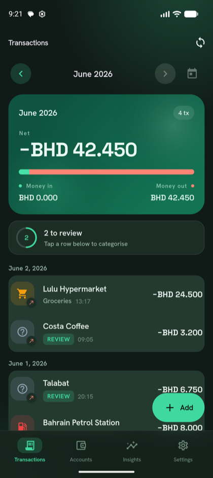
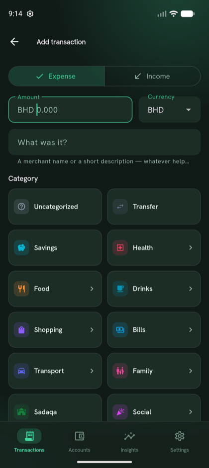
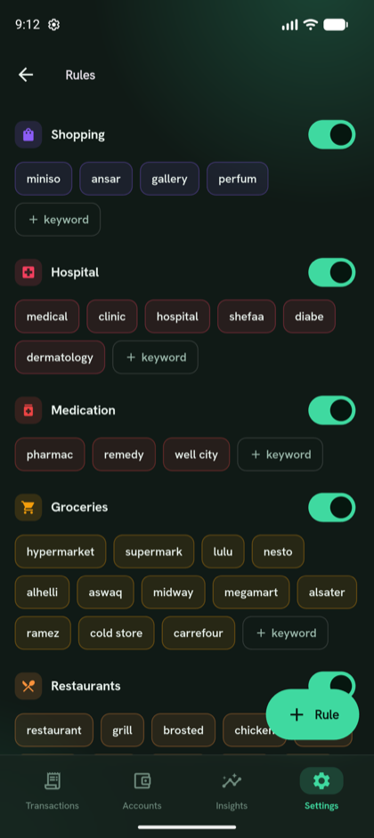
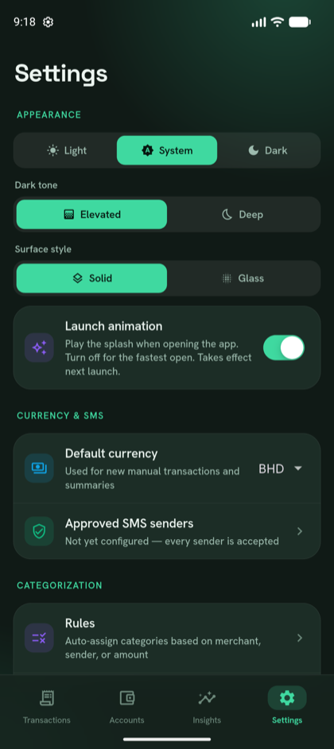

# MoneyTrack

**A privacy-first money tracker for Bahrain — built around your bank's SMS.**

It reads your bank text messages, turns each one into a categorized transaction,
and nudges you to review the few it isn't sure about. No account. No server.
**Everything stays on your phone.**

---

## ✨ What it does

- **Auto-logging from bank SMS** — card purchases, Fawri / Fawri+ transfers, and
  bank charges are parsed the moment they arrive. Nothing to type.
- **Smart categorization** — a built-in rule set (~80 merchants out of the box)
  assigns categories by merchant, sender, or amount. Anything it can't place
  lands in a **"to review"** list so your books are never silently wrong.
- **Your own rules & categories** — a two-level category tree (parent + sub),
  plus a simple *"merchant contains keyword → category"* editor you fully control.
- **Monthly view** — each month stands on its own: money in, money out, net, and
  a per-day breakdown.
- **Manual entries** — add cash spending or anything off-SMS in a couple of taps.
- **Make it yours** — light / dark / system themes, dark-tone and surface styles,
  and an optional launch animation.
- **Optional Google Drive backup** — to a **private, app-only** folder you own.
- **In-app updates** — check for new versions (or auto-check on open) and read the
  changelog right inside the app.

---

## 📱 Screenshots

<table>
  <tr>
    <td align="center"> <b>Monthly transactions</b></td>
    <td align="center"> <b>Add &amp; categorize</b></td>
  </tr>
  <tr>
    <td align="center"> <b>Custom rules</b></td>
    <td align="center"> <b>Appearance &amp; settings</b></td>
  </tr>
</table>

---

## 📥 Download

Grab the latest `money-tracker-vX.Y.Z.apk` from the
**[Releases](https://github.com/AhmedMerza/money-tracker-releases/releases/latest)**
page and open it on your Android phone.

> Requires **Android 8.0 (API 26)** or newer. Android only.

---

## 📲 Install (one-time setup)

Because the app reads bank SMS to auto-log transactions, Android adds a couple
of safety gates the first time. You only do these once.

### 1 · Get past Play Protect
When the install dialog says **"Blocked to protect your device"**:
1. Tap **More details**
2. Scroll to the bottom → **Install anyway** (may be greyed out for ~5 seconds — wait it out)

If there's no **Install anyway** button:
1. **Settings → Security & privacy → Google Play Protect → ⚙ (top-right)**
2. Turn **off** "Scan apps with Play Protect"
3. Install the APK
4. Turn Play Protect back **on** — already-installed apps are left alone

### 2 · Unlock Restricted Settings (Android 13+)
The first time the app asks for SMS permission, Android silently denies it until
you allow restricted settings:
1. **Settings → Apps → MoneyTrack → ⋮ (top-right) → "Allow restricted settings"**
2. Go back → **Permissions → SMS → Allow** (and **Notifications → Allow** while you're there)

### 3 · Open the app
On first launch it scans your inbox for past bank messages and starts logging
new ones automatically.

---

## 🔄 Updates

Updates install **over** the previous version — they're signed with the same key,
so **your data is kept** and Play Protect won't re-flag a trusted app.

In the app: **Settings → App → Check for updates** (or turn on **Auto-check on
open**) fetches the newest release and shows the changelog **in-app** — no need
to come back here.

---

## 🔒 Privacy

- **100% on-device.** No account, no server, no analytics.
- Bank SMS are read locally and **never leave your phone**.
- Optional Google Drive backup goes to a **private app-only folder** you control.
